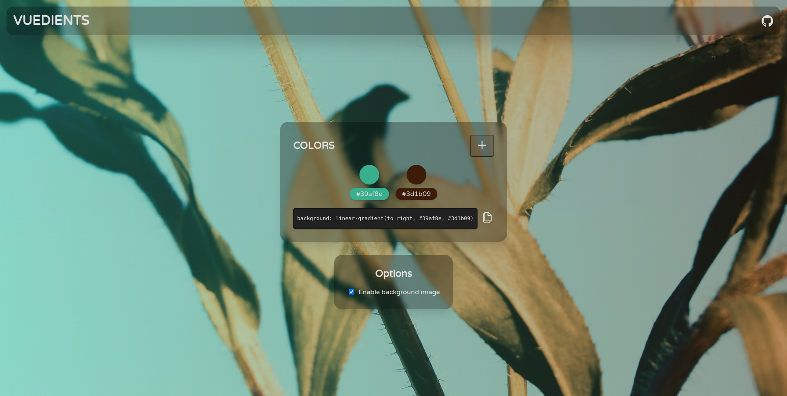

# vuedients

Simple app for creating and viewing gradients

[](https://app.netlify.com/sites/vuedients/deploys)



## Features

- PWA support
- Simple, beautiful and fast. Features glassmorphism
- Build using [Vue.js](https://vuejs.org/) + [TypeScript](https://www.typescriptlang.org/)
- All of the data stays in your browser

## Project setup
```
yarn install
```

### Compiles and hot-reloads for development
```
yarn serve
```

### Compiles and minifies for production
```
yarn build
```

### Lints and fixes files
```
yarn lint
```

### Customize configuration
See [Configuration Reference](https://cli.vuejs.org/config/).

## License

[MIT](LICENSE)
